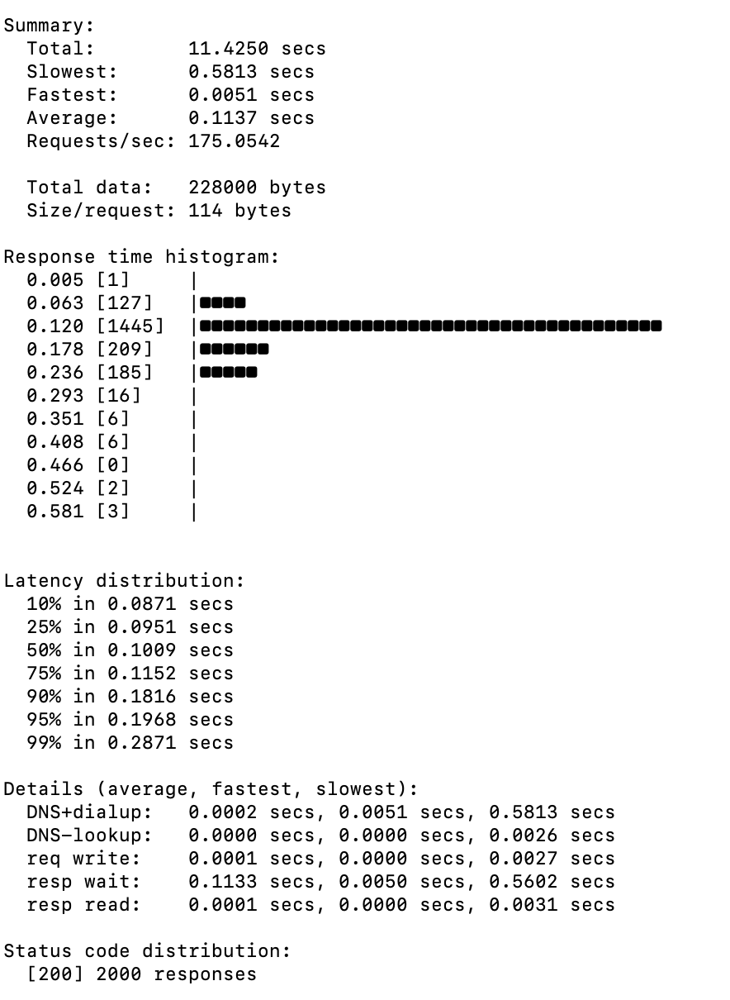
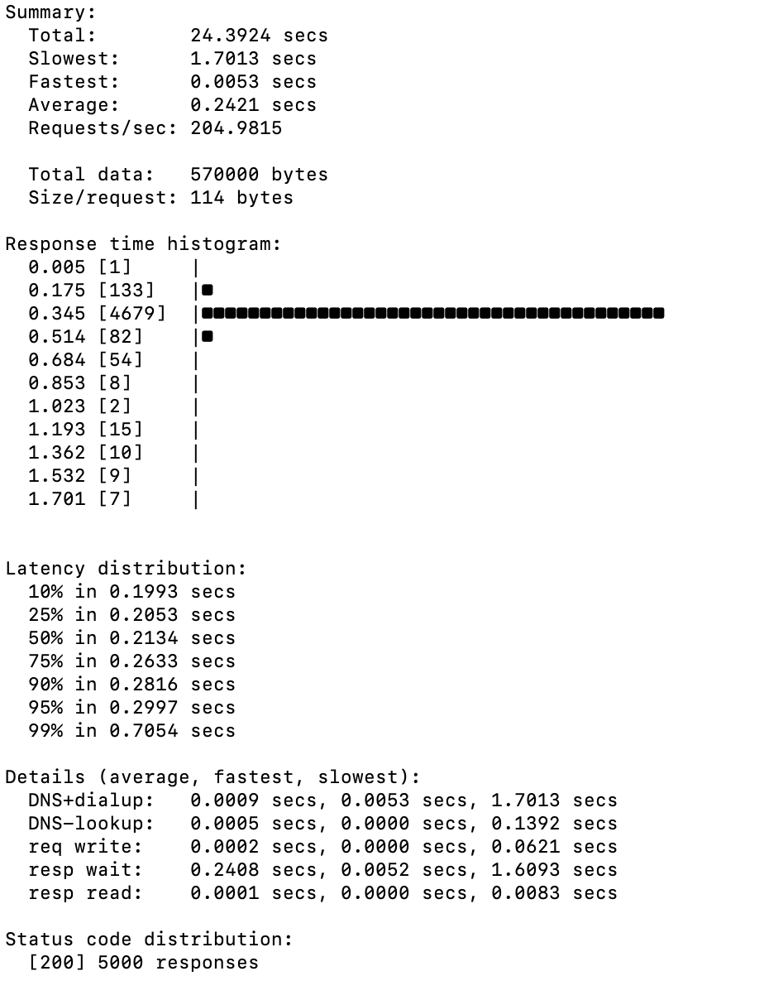
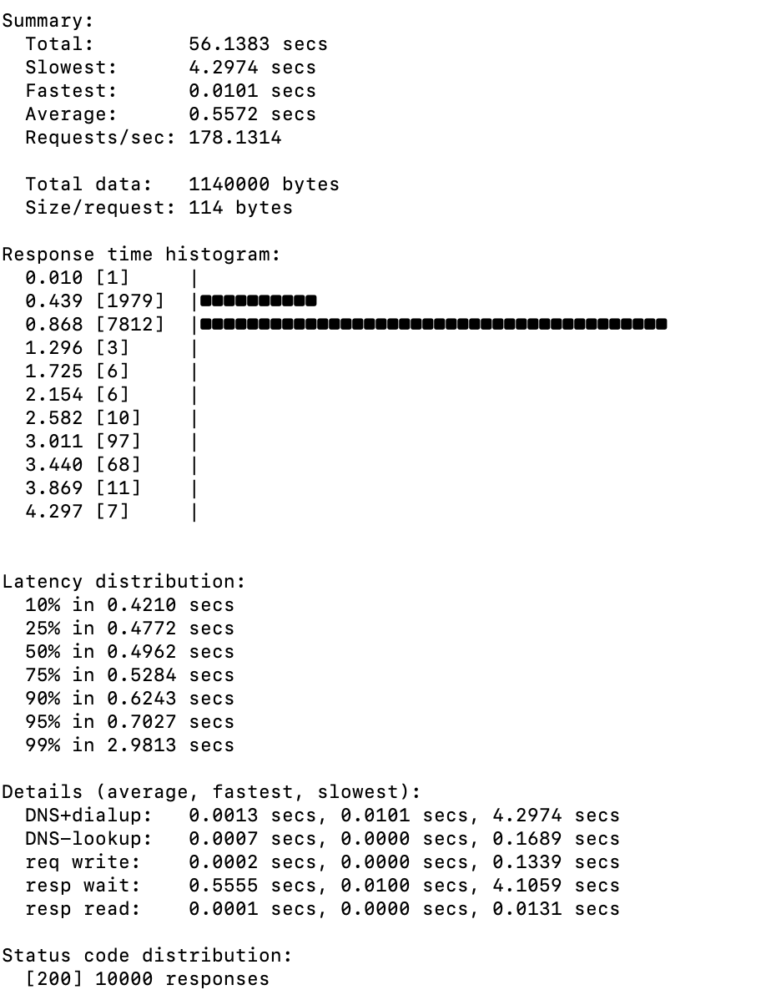
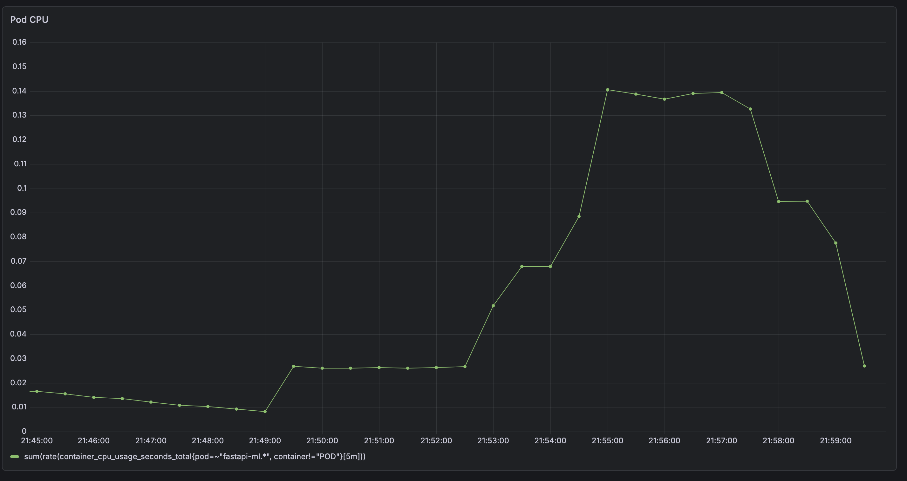
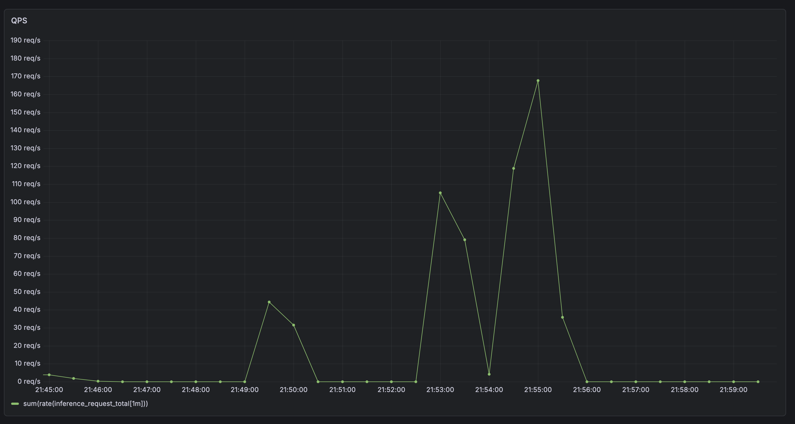
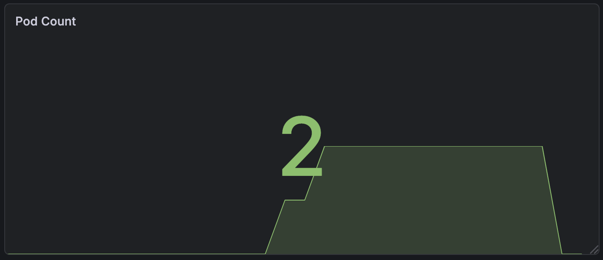
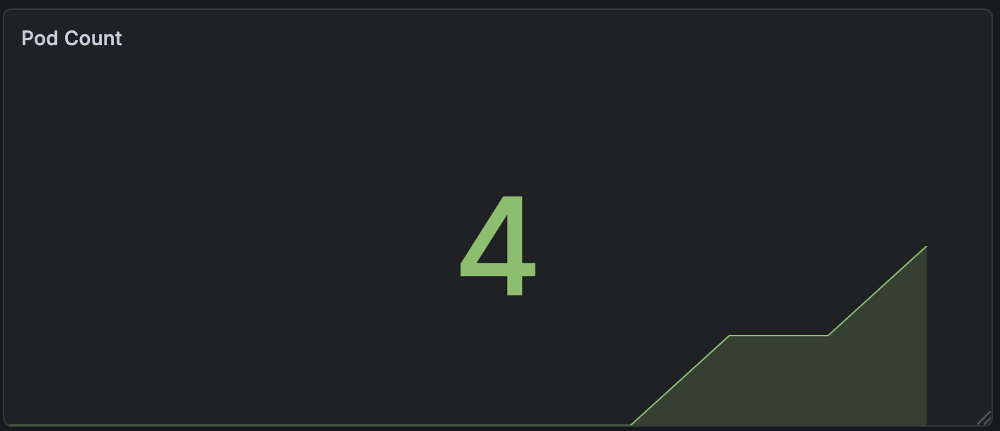
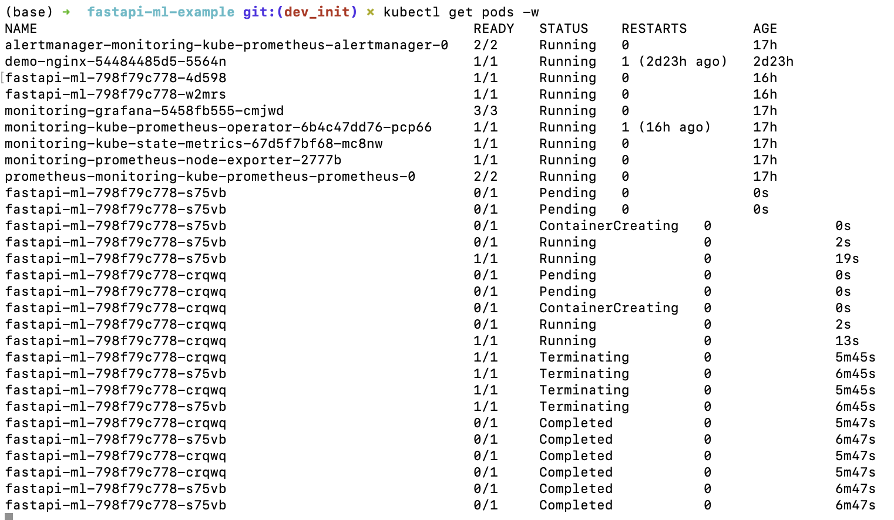

# Performance Benchmark

## Test Setup

- Tool: hey
- Endpoint: /predict
- Environment: local Kubernetes (minikube)
- Model: lightweight sklearn model

---

## Load Test Results

### Low Concurrency

- Average latency: ~0.11s
- P95 latency: ~0.20s
- QPS: ~175 req/s
- 系统响应稳定，延迟较低

---

### Medium Concurrency

- Average latency: ~0.24s
- P95 latency: ~0.30s
- QPS: ~200 req/s
- 随着并发增加，延迟上升，但系统仍保持稳定

---

### High Concurrency

- Average latency: ~0.55s
- P95 latency: ~0.70s
- QPS: ~178 req/s
- 在高并发下延迟明显上升，但未出现错误（200 responses）

---

## Metrics Observation (Grafana)

### P95 Latency

- P95 延迟随负载增加逐步上升
- 在高负载阶段达到约 9–10 ms（服务内部指标）

---

### CPU Usage

- CPU 使用率在压测过程中明显上升
- 峰值约为 0.14，说明系统负载增加

---

### QPS

- QPS 在压测阶段出现明显峰值
- 峰值约为 160–170 req/s

---

## Observations

- 系统在低到中等并发下运行稳定
- 随着并发增加，延迟逐步上升（符合预期）
- 在高并发测试中未出现错误响应（100% 200 OK）
- CPU 使用率与延迟变化趋势一致，说明瓶颈主要在计算资源

---

## Limitations

- 测试基于本地 Kubernetes 环境（minikube），不代表生产环境性能
- 并发规模有限（未进行大规模压力测试）
- 未引入真实业务数据流量

---

## Conclusion

该系统在中等负载下能够稳定运行，并具备基础的性能扩展能力。

虽然测试规模有限，但结果验证了系统在负载增加时的可预期行为，以及良好的稳定性。

## Autoscaling Behavior (HPA)

### Pod Scaling

- 初始状态：2 个 Pod
- 在压测期间，Pod 数量自动扩容至 4 个
- 负载下降后，Pod 数量回落至 2 个

---

### HPA Status

- HPA 目标 CPU：50%
- 实际 CPU 在高负载阶段达到 100%
- 当 CPU 超过阈值时触发扩容

---

### Pod Lifecycle

- 新 Pod 依次经历：
  - Pending → ContainerCreating → Running
- 在缩容阶段，Kubernetes 优先终止新创建的 Pod，以恢复到目标副本数

---

### Metrics Correlation

- QPS 上升 → CPU 使用率上升  
- CPU 超过 50% → HPA 触发扩容  
- Pod 数量增加 → P95 延迟下降  

---

## Impact of Autoscaling

| Scenario   | Pods | P95 Latency | CPU |
|------------|------|-------------|-----|
| Before HPA | 2    | ~16–18 ms   | 高  |
| After HPA  | 4    | ~9–10 ms    | 降低 |

---

### Observation

扩容后系统延迟明显下降，说明增加副本有效提升了处理能力。

---

### Observations

- 系统在负载增加时能够自动扩容（2 → 4 Pods）
- 扩容过程中系统保持稳定（无错误请求）
- 扩容后延迟下降，说明扩容有效缓解了压力
- 缩容过程平滑，没有出现明显波动

---

### Limitations

- 扩容存在一定延迟（Pod 启动时间）
- HPA 仅基于 CPU 指标，未考虑业务指标（如延迟）
- 在突发流量下可能存在短暂性能下降（cold start）

---

### Conclusion

系统成功实现了基于 CPU 的自动扩缩容机制。

在负载上升时，HPA 能够自动增加 Pod 数量以提升系统处理能力，
并在负载下降后恢复到较低资源使用水平，体现了良好的弹性能力。