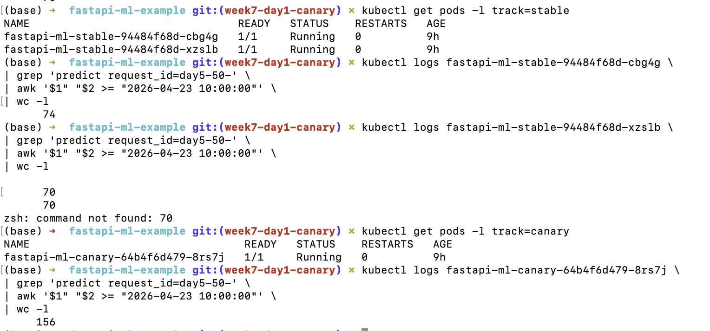
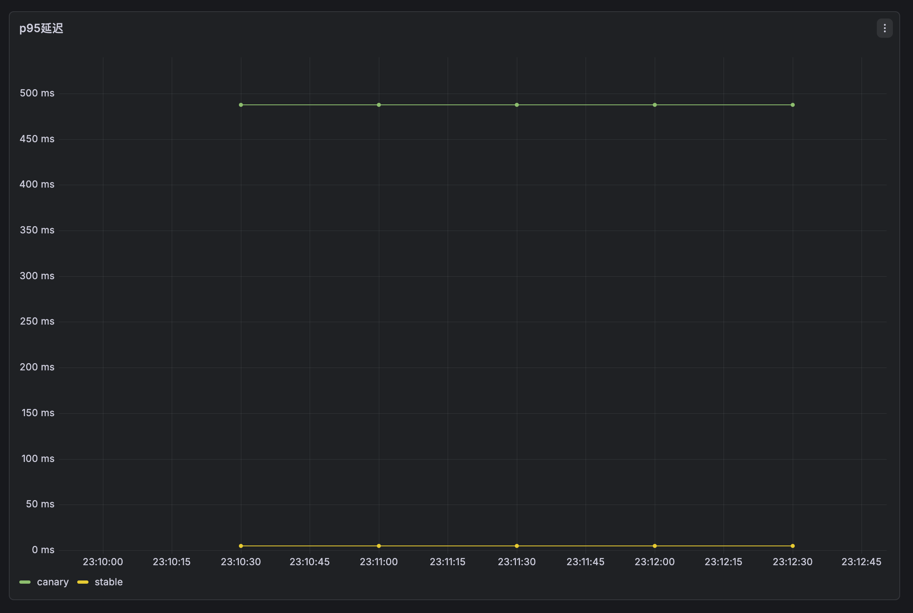
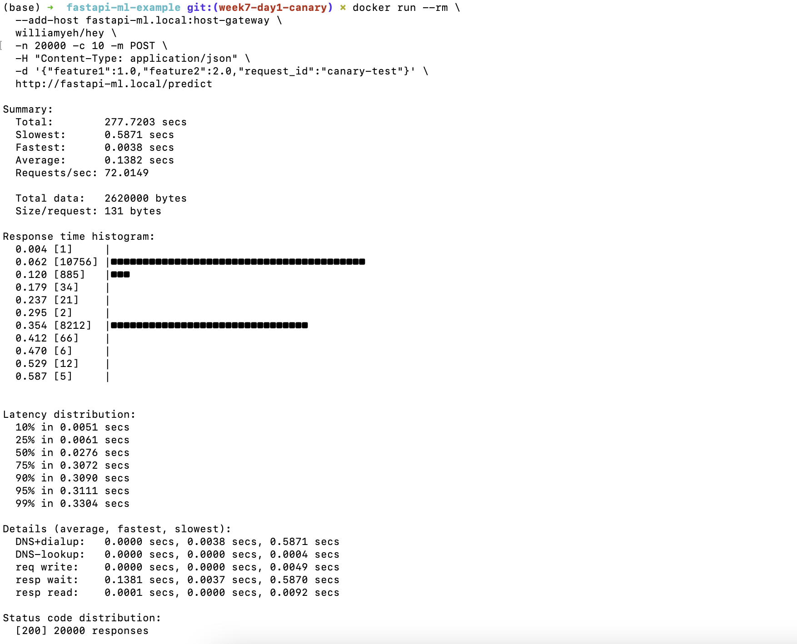
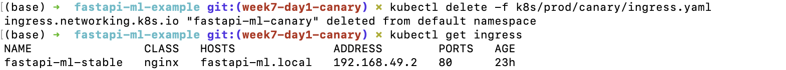
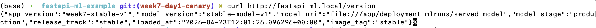
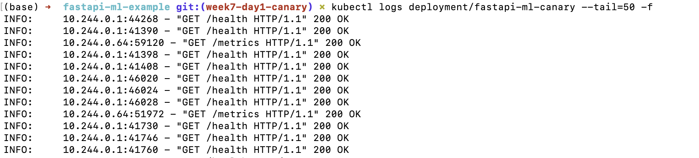
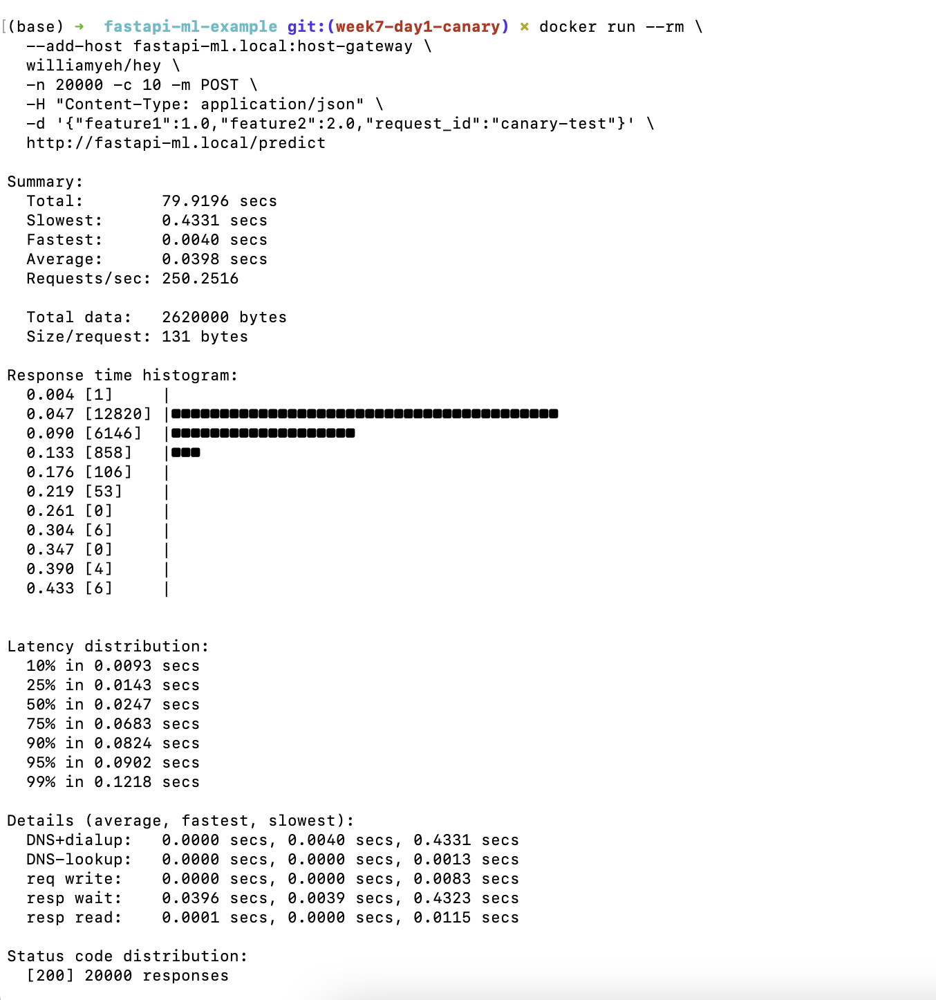
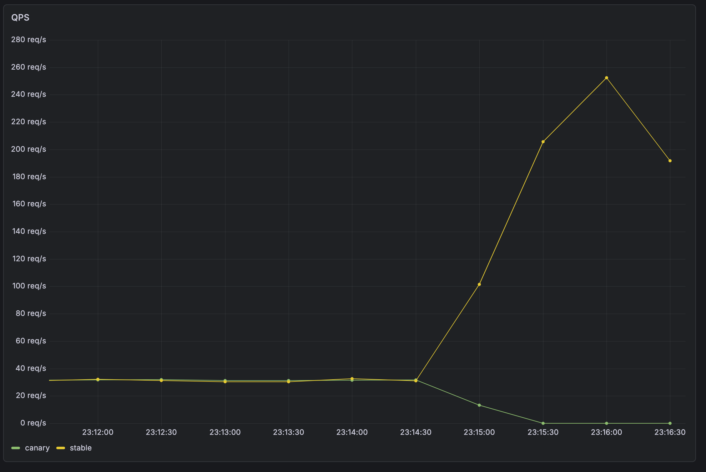

# 📊 Canary + 回退测试报告

## 1️⃣ 灰度流量验证（50%阶段）
📌 测试命令
```bash
kubectl logs fastapi-ml-stable-xxx | grep request_id | wc -l
kubectl logs fastapi-ml-canary-xxx | grep request_id | wc -l
```
📌 测试结果
- stable ≈ 140+
- canary ≈ 150+



✅ 结论
- Canary 流量约占 50%，符合 ingress 配置。

---

## 2️⃣ 性能分析（回退前）
🔴 p95 延迟



📌 观察
- stable ≈ 5 ms
- canary ≈ 480 ms
🔴 压测结果



📌 数据
- Avg latency ≈ 138 ms
- QPS ≈ 72 req/s
🚨 根因分析
- Canary 版本人为加入延迟（sleep），导致性能显著下降。

```Python
if runtime.release_track == "canary":
    time.sleep(0.3)
```

🔴 延迟指标差异分析
在本次测试中，观察到以下现象：

- hey 压测结果显示：
	- 平均延迟 ≈ 138 ms
	- 一半的请求（canary）集中在 ≈ 350 ms
	- p95 延迟 ≈ 311 ms
- Grafana 显示：
	- p95 延迟 ≈ 480 ms

两者存在明显差异，其原因如下：
在测试中对比 hey 与 Grafana 的 p95 延迟发现存在差异：hey 的 p95 约为 311ms，而 Grafana 显示约为 480ms。该差异主要来源于统计方式不同。hey 的 p95 基于单次压测的真实请求分布，而 Grafana 的 p95 是通过 Prometheus histogram_quantile 估算得到，会受到分桶（bucket）离散化影响。

在本次测试的 canary 场景中，请求延迟呈现出明显的双峰偏态分布：一部分请求（stable）集中在较低延迟区间，而另一部分请求（canary）由于人为引入延迟，集中在约 300–350ms 区间。这种分布在 bucket 之间存在“断层”（即中间区间样本较少），导致 histogram_quantile 在计算 p95 时需要在较大区间内进行线性插值。

例如，约 350ms 的请求可能被归入 0.5s bucket，从而使 p95 被系统性向上估计，接近 bucket 上界（≈480–500ms）。这种偏差并非随机波动，而是由分桶机制带来的稳定高估（systematic bias）。

此外，Grafana 的指标基于时间窗口（如 rate[1m]）聚合，在低流量或流量分布不均的 canary 场景下，更容易受到分布不稳定的影响，进一步放大该偏差。

因此，Grafana 的 p95 通常略高，更偏向反映系统尾延迟的上界，而 hey 直接基于原始样本计算分位数，更接近真实请求分布。

---

## 3️⃣ 回退操作
📌 执行命令
```bash
kubectl delete -f k8s/prod/canary/ingress.yaml
```

📌 Ingress 状态



👉 只剩 stable


---


## 4️⃣ 回退后验证
✅ 功能验证
```bash
curl http://fastapi-ml.local/version
```


✅ 日志验证



📌 观察
- 仅存在：
	- /health
	- /metrics
- 没有 /predict

✅ 结论
- 回退后 canary 已不再接收业务流量。

---

## 5️⃣ 回退后性能分析
🟢 压测结果（回退后）



📌 数据
Avg latency ≈ 39 ms
QPS ≈ 250 req/s
🟢 p95 延迟


📌 观察
- 恢复到正常水平（≈5ms）

🟢 QPS 变化



📌 观察
- canary → 0
- stable → 上升

---

## 🔥 6️⃣ 回退前后对比
|指标		|	回退前			|	回退后	|
|-----------|-------------------|-----------|
|Avg 		|	延迟	138 ms		|	39 ms	|
|QPS		|	72				|	250		|
|p95		|	480ms（canary）	|	恢复正常	|

✅ 核心结论
- Canary 版本在高负载下导致性能严重下降。
- 通过回退操作，系统快速恢复至稳定状态，
- 证明 Canary 发布机制能够有效隔离风险。

---

## 🎯 7️⃣ 测试总结
1. 成功实现 Canary 灰度发布
2. 通过监控识别性能问题
3. 成功执行回退并验证系统恢复
4. 完成生产级部署闭环（deploy → observe → rollback）