# 项目结果与关键证据（Results & Evidence）

本项目实现了一个完整的 ML 推理系统，涵盖模型服务化、版本管理、Kubernetes 部署、监控、自动扩缩容、CI/CD 以及灰度发布与回滚。

---

## 1. 模型服务化与版本接口

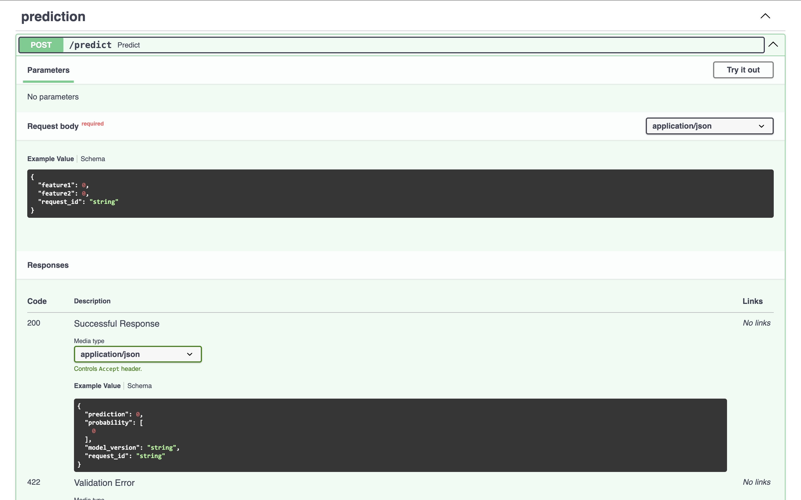
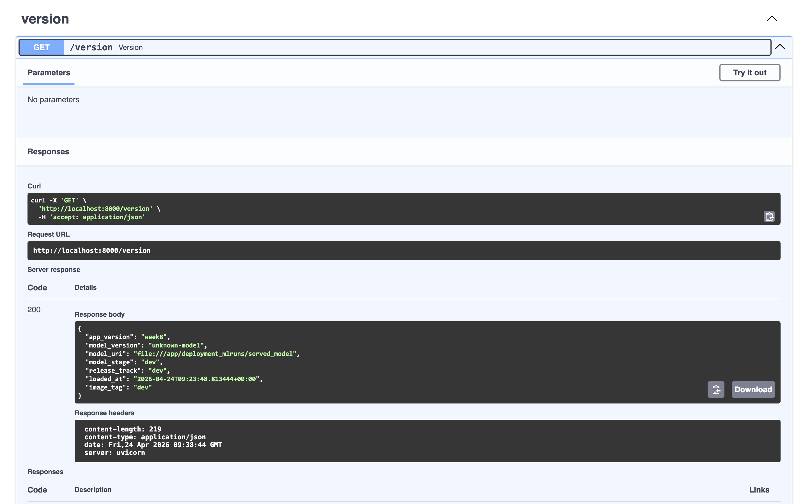

- 基于 FastAPI 实现模型推理服务，提供 `/predict`、`/health`、`/version` 接口
- `/version` 返回模型版本、应用版本和发布轨道（stable/canary）
- 推理逻辑与模型加载解耦，支持后续模型版本切换

---

## 2. MLflow 模型管理

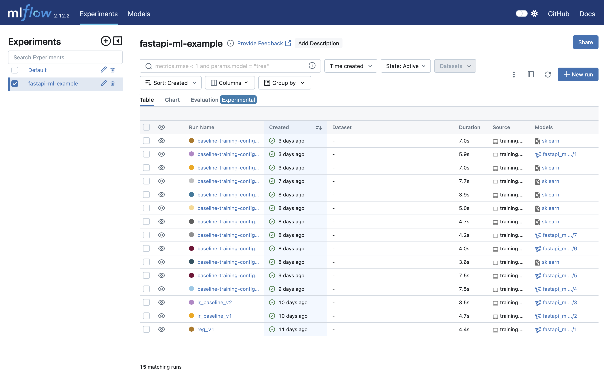

- 使用 MLflow 记录训练参数、指标和模型产物
- 支持通过模型 URI 加载模型，实现训练与部署解耦
- 模型版本独立管理，为灰度发布和回滚提供基础

---

## 3. Kubernetes 部署与多副本服务

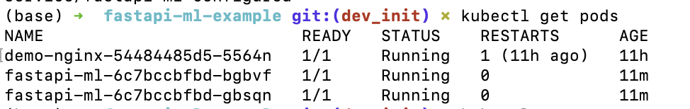
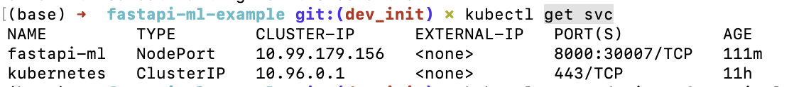

- 服务部署在 Kubernetes 上，通过 Deployment 管理多副本（replicas=2）
- Service 提供稳定访问入口，避免依赖 Pod IP
- 支持通过 port-forward 在本地访问服务接口

---

## 4. 探针、滚动更新与故障恢复

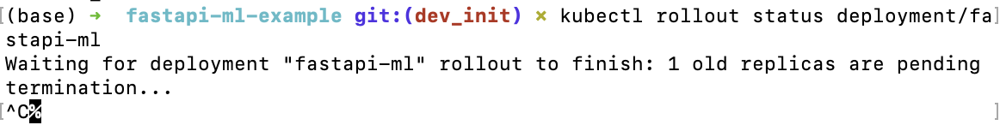
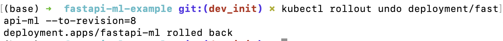

- 配置 readiness 和 liveness probes，区分流量接入与容器健康
- 使用 RollingUpdate 实现低中断部署
- 支持通过 rollout undo 快速回滚失败版本

---

## 5. 可观测性（Prometheus + Grafana）

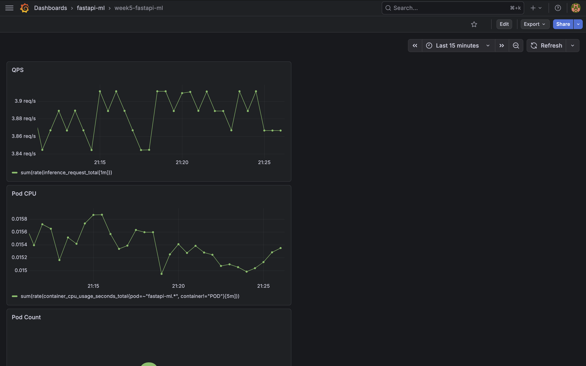
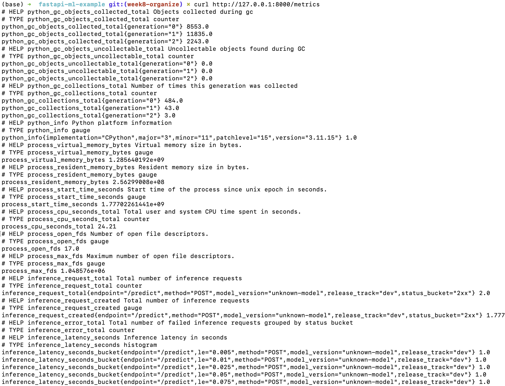

- 暴露应用级指标：请求数、错误数、推理延迟
- 使用 Prometheus 抓取指标，Grafana 展示系统状态
- 支持按版本（stable/canary）区分监控数据

---

## 6. 压测与自动扩缩容（HPA）

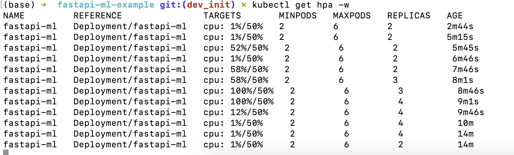
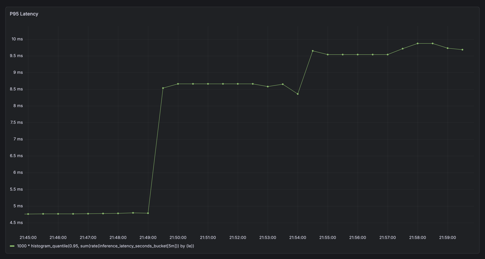

- 使用压测工具模拟高并发请求，分析 QPS 与 p95 延迟
- 基于 CPU 使用率配置 HPA 自动扩缩容
- 在高负载下 Pod 数量自动增加，系统具备弹性伸缩能力

---

## 7. CI/CD（构建与部署链路）

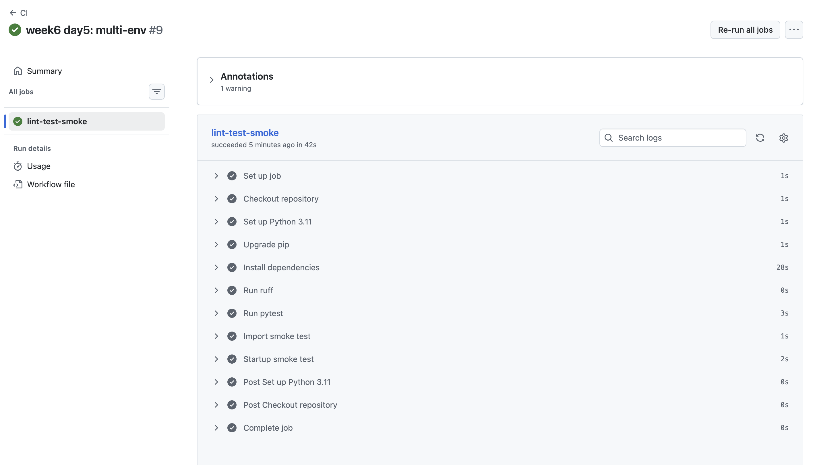
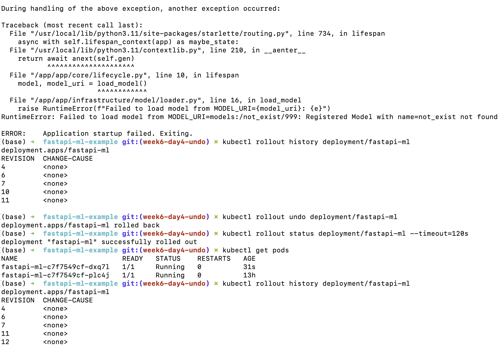

- 使用 GitHub Actions 自动构建 Docker 镜像（build & push）
- 镜像通过本地 Kubernetes 部署并验证 rollout 状态
- 部署失败时支持手动/脚本回滚，保障服务稳定性

---

## 8. Canary 灰度发布与回滚演练

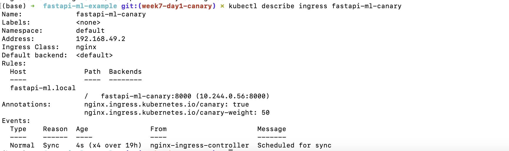
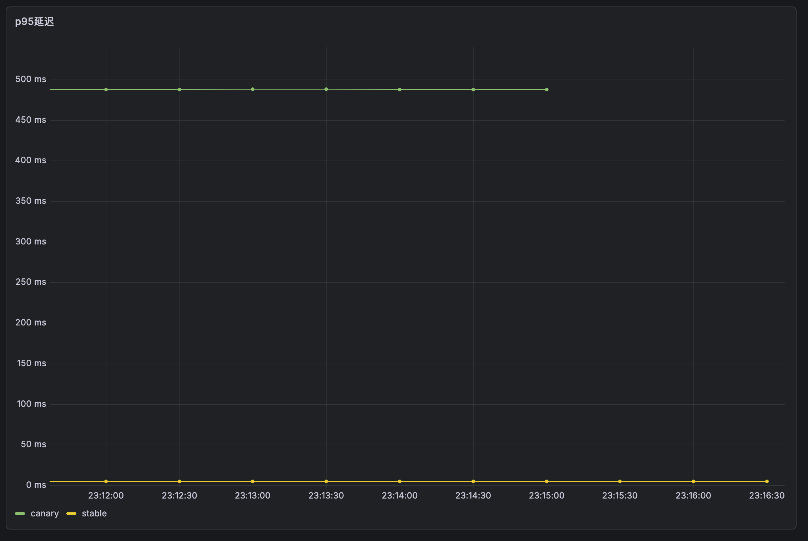

- 同时部署 stable 与 canary 两个版本，实现双版本共存
- 通过 Ingress 控制流量比例（10% → 30% → 50%）
- 基于延迟与错误率判断是否继续放量或回滚
- 当指标异常时回滚至 stable，系统恢复正常