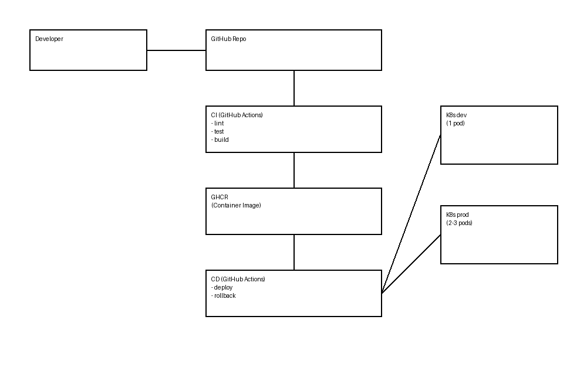

# ML Deployment System (Week6)

## 项目简介

本项目实现了一个简单的机器学习部署系统，主要包含：

- FastAPI：模型服务接口
- Docker：容器化部署
- Kubernetes：服务编排与运行
- GitHub Actions：CI/CD 自动化流程

---

## 系统架构



---

## CI/CD 流程

- CI：
  - 代码检查（lint）
  - 单元测试（pytest）
  - 构建 Docker 镜像

- CD：
  - 自动部署到 dev 环境
  - 使用 `kubectl set image` 更新镜像
  - 使用 `kubectl rollout status` 检测部署状态
  - 部署失败自动回滚（rollback）

---

## 多环境设计

系统包含两个环境：

- dev（开发环境）：自动部署
- prod（生产环境）：手动发布

---

## 环境差异

dev 与 prod 主要区别：

- 副本数（replicas）
- 资源限制（CPU / 内存）
- 模型阶段（staging / production）
- 发布轨道（dev / stable）

---

## 项目结构
project/
    app/ # FastAPI 应用
    k8s/
        dev/ # dev 环境配置
        prod/ # prod 环境配置
    .github/workflows/ # CI/CD 流水线
    docs/ # 文档
    README.md

---

## 总结

当前系统已经具备：

- 自动化 CI/CD 流程
- 部署失败自动回滚能力
- 多环境隔离（dev / prod）
- 基础生产级部署能力


# Week6 Day1 – CI 搭建

## 今日工作
- 新增 GitHub Actions 工作流（.github/workflows/ci.yml）
- 接入自动化检查：
  - ruff（代码规范检查）
  - pytest（单元测试）
  - import smoke test（基础导入检查）
  - startup smoke test（服务启动检查，使用 mock 模型）

## 意义
- 每次代码提交都会自动验证
- 防止错误代码进入主分支
- 避免“测试通过但服务无法启动”的问题

## 结果
- CI 流水线可自动触发（push 后执行）
- 所有检查通过（workflow 为绿色）
- 项目具备基础持续集成能力

## 说明
- 本地开发仍使用 Docker（scripts/check_all.sh）
- CI 采用轻量检查（lint + test + smoke），保证速度和稳定性


# Week6 Day2 – 镜像构建与模型部署解耦

## 今日工作

- 新增 Docker 镜像构建与推送 workflow（GitHub Actions）
- 实现代码 push 后自动：
  - build Docker image
  - push 到容器仓库（GHCR）
- 完成模型部署方式重构：
  - 不再依赖整个 mlruns 目录
  - 引入 deployment_mlruns 作为部署专用模型产物目录
- 重构 promote_model.py：
  - 从 MLflow URI（models:/ 或 runs:/）加载模型
  - 导出为部署专用 MLflow artifact
  - 生成 promotion metadata
- 修改 Dockerfile：
  - 删除 COPY mlruns
  - 改为 COPY deployment_mlruns
- 更新本地质量门禁脚本（check_all.sh）：
  - 新增 deployment artifact 校验
  - 集成 promote 流程
  - 完整 smoke test（health / version / predict）

---

## 关键改进点

### 1. 模型部署解耦（核心提升）

将系统从：

> 服务直接依赖 MLflow 本地实验目录（mlruns）

升级为：

> 服务只依赖部署专用模型产物（deployment artifact）

实现了：

- 实验环境（mlruns）与部署环境解耦
- Docker 构建不再依赖本地训练产物
- 更符合真实生产系统架构

---

### 2. 模型加载方式统一

- 服务层仍通过 MLflow 加载模型（mlflow.load_model）
- 但统一为部署专用 URI：file:///app/deployment_mlruns/served_model


实现：

- promote 层支持多种模型来源（models:/、runs:/）
- serving 层只保留一种标准加载方式

---

### 3. 自动化镜像构建

实现 CI 自动：

- 构建镜像
- 打 tag（latest + commit sha）
- 推送到容器仓库

优势：

- 不再手动 docker build
- 镜像版本可追踪
- 为后续 CD（自动部署）打基础

---

### 4. 本地全链路质量门禁

通过 `scripts/check_all.sh` 实现：

- lint（ruff）
- 单元测试（pytest）
- 训练流程
- promote（生成 deployment artifact）
- API 启动验证
- 接口 smoke test

确保：

> 本地通过 = 基本可部署

---

## 当前系统架构（简化）
Training / MLflow Tracking
↓
promote_model.py
（选择模型 + 导出 deployment artifact）
↓
deployment_mlruns/served_model
↓
Docker image（仅包含部署模型）
↓
K8s / 服务加载
（统一 MODEL_URI）


---

## 今日结果

- CI workflow 通过 ✔
- Docker build & push 成功 ✔
- 本地 check_all.sh 全链路通过 ✔
- 服务可正常加载部署模型并预测 ✔

---

## 说明

- 本地仍使用 .env 作为开发配置载体
- K8s 环境通过 Deployment env 注入 MODEL_URI
- deployment_mlruns/served_model 不提交到 Git，仅作为构建产物

---

## 下一步（Week6 Day3）

- 将模型上线流程接入 CD（持续部署）
- 自动将 MODEL_URI 注入 K8s Deployment
- 实现：
  - promote → deploy → rollout
- 完成端到端模型上线自动化流程


# Week6 Day3 – Kubernetes CD

## 今日工作
- 新增 CD workflow（.github/workflows/cd.yml）
- 使用 `kubectl set image` 作为 Deployment 更新方式
- 使用 `kubectl rollout status` 检查发布状态
- 记录 rollout duration
- 本地验证 sha tag 镜像可成功部署到 minikube

## 关键结论
- `latest` 不适合作为正式部署标签，容易受到缓存影响
- commit sha tag 更稳定、更可追踪
- 当前项目采用：
  - CI 负责 build & push image
  - CD 负责 set image + rollout status

## 结果
- 新镜像已在本地 minikube 成功部署
- Pod 可正常启动
- 服务健康检查通过

## 说明
- 当前集群为本地 minikube，GitHub-hosted runner 无法直接访问本地 Kubernetes API
- 因此本阶段已完成 CD workflow 编写与本地部署验证
- 真实生产环境中会使用云上 Kubernetes、self-hosted runner 或受控 kubeconfig / OIDC 实现真正自动部署


# Week6 Day4 - CI/CD 故障案例 —— 模型加载失败与回滚
## 1. 场景说明（Scenario）

本实验模拟了一种由模型配置错误引发的部署失败场景。

不同于使用错误镜像，这里通过人为注入错误的模型 URI：

MODEL_URI=models:/not_exist/999

该场景更贴近真实的 ML 系统问题：
基础设施部署成功，但应用在启动阶段因模型加载失败而崩溃。

## 2. 故障注入（Failure Injection）

通过以下命令触发故障：

kubectl set env deployment/fastapi-ml MODEL_URI=models:/not_exist/999

更新环境变量后，Kubernetes 触发滚动更新，并尝试使用该错误配置启动新的 Pod。

## 3. 现象（Symptoms）
新 Pod 启动失败
Pod 进入 CrashLoopBackOff 状态
kubectl rollout status 无法成功完成
应用日志显示模型加载失败

与此同时：

旧 Pod 仍然 Running 且 Ready
服务请求仍由旧 Pod 提供（无服务中断）
## 4. 定位（Investigation）

通过以下常规排障命令进行分析：

kubectl get pods
kubectl describe pod <pod-name>
kubectl logs <pod-name>
kubectl rollout history deployment/fastapi-ml

关键发现：

新 Pod 持续重启
容器在启动阶段加载模型失败
Readiness 探针始终未通过
Deployment 无法完成更新

## 5. 根因（Root Cause）

问题由错误的 MODEL_URI 导致：

models:/not_exist/999

在应用启动过程中：

FastAPI 生命周期钩子（lifespan）尝试加载模型
模型加载器抛出异常（模型不存在）
容器启动失败

最终导致：

新 Pod 无法进入 Ready 状态
滚动更新过程被阻塞
## 6. 恢复（回滚）（Recovery / Rollback）

通过以下命令进行回滚：

kubectl rollout undo deployment/fastapi-ml

随后验证：

kubectl rollout status deployment/fastapi-ml

回滚结果：

旧版本 Pod 恢复为运行状态
错误版本 Pod 被终止
服务恢复正常

## 7. 验证（Verification）

回滚后执行：

kubectl get pods
kubectl rollout history deployment/fastapi-ml

结果：

所有 Pod 均正常运行
Deployment 恢复到稳定版本
## 8. 关键观察（Key Observations）
Kubernetes 滚动更新机制能够保障服务可用性
旧 Pod 持续提供服务
异常 Pod 不会进入负载均衡
故障发生在应用启动阶段（模型加载），而非基础设施层

## 9. 对 CI/CD 的启示（CI/CD Implication）

基于本次实验，CD 流水线应包含：

kubectl rollout status --timeout=...

以及自动回滚机制：

kubectl rollout undo deployment/fastapi-ml

从而实现：

自动检测发布失败
在出现问题时自动恢复到稳定版本
## 10. 总结（Conclusion）

本实验验证了：

系统能够应对错误模型配置带来的风险
回滚机制可以快速恢复服务
失败检测 + 自动回滚 是生产级 ML 部署的关键能力

该案例构成了 CI/CD 流水线中“可靠发布能力”的重要组成部分。


# Week6 Day5 – 多环境部署（Dev / Prod）

## 1. 概述

本阶段引入环境隔离机制，避免直接将变更部署到生产环境。

- **dev**：用于测试与验证  
- **prod（default namespace）**：用于稳定服务  

---

## 2. Namespace 设计

| 环境 | Namespace |
|------|----------|
| dev  | dev |
| prod | default |

---

## 3. 配置差异

dev 与 prod 至少存在以下三点差异：

1. **副本数（Replica）**
   - dev：1
   - prod：2（或 3）

2. **资源限制（Resources）**
   - dev：较低的 CPU / 内存
   - prod：更高资源，保证稳定性

3. **模型阶段 / 发布轨道**
   - dev：`MODEL_STAGE=staging`，`RELEASE_TRACK=dev`
   - prod：`MODEL_STAGE=production`，`RELEASE_TRACK=stable`

---

## 4. 部署策略

- CI/CD 流水线只自动部署到 **dev**
- 生产环境采用**手动发布**

dev 部署：
```bash
kubectl apply -n dev -f k8s/dev/
```
prod 部署（手动）：
```bash
kubectl apply -f k8s/prod/
```